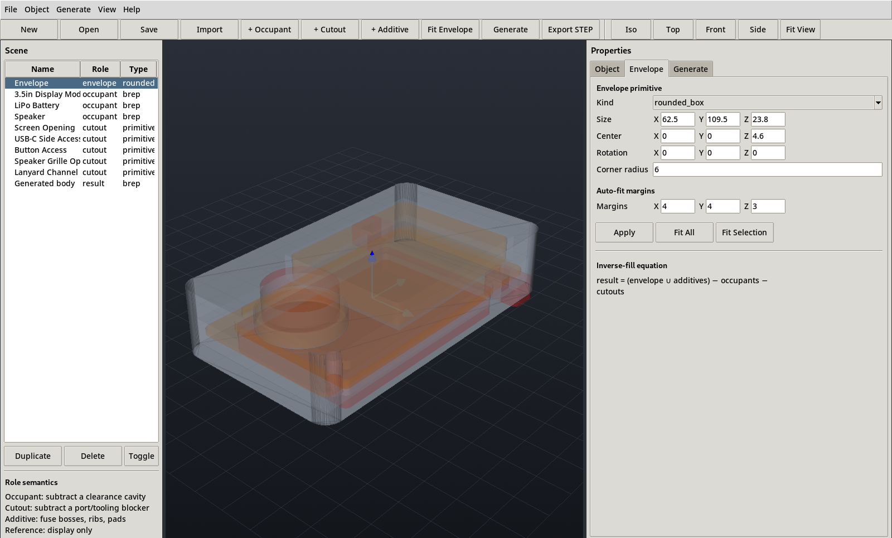

# FlipFill CAD

**FlipFill CAD** is a clearance-first enclosure generator for the common workflow:

1. import several hardware models;
2. position the screen, board, battery, speaker, connectors, and other parts;
3. draw or auto-fit a rounded bounding solid around the stack;
4. mark occupied space and access paths;
5. invert the volume into an enclosure body; and
6. export editable STEP solids for final work in Fusion 360, FreeCAD, or another BRep CAD system.



The core equation is deliberately simple and inspectable:

```text
result = (envelope ∪ additives) − occupant-clearances − cutout-blockers
```

This is not a mesh sculpting trick. The engine uses CadQuery and OpenCascade boundary-representation operations, validates the result, and exports STEP.

## What the first release does

- Imports `.step`, `.stp`, `.brep`, `.brp`, `.iges`, and `.igs` as true BRep geometry.
- Imports common mesh formats as positioned visual references with robust AABB Boolean proxies.
- Positions each object with numeric XYZ translation and rotation.
- Assigns explicit roles: **Occupant**, **Cutout**, **Additive**, or **Reference**.
- Creates box, rounded-box, cylinder, and slot primitives.
- Applies three clearance strategies:
  - **Exact**: subtract the original BRep.
  - **Offset**: grow the BRep with OpenCascade before subtraction; falls back to AABB if the imported topology cannot be offset safely.
  - **AABB**: subtract an expanded world-axis-aligned bounding box. This is intentionally conservative and very robust for batteries, screens, PCBs, speakers, and wire/service volumes.
- Auto-fits a rounded envelope around all included objects using configurable XYZ margins.
- Adds port, button, cable, speaker-grille, ventilation, tooling, and assembly cutouts with blocker primitives.
- Adds bosses, pads, ribs, and other positive geometry with additive primitives or imported solids.
- Generates and validates the inverse-fill body.
- Detects residual enclosure/cavity intersections and overlapping occupant clearances.
- Optionally splits the result along X, Y, or Z.
- Exports:
  - generated STEP;
  - printable STL;
  - optional split-half STEP files;
  - a **fit-check STEP assembly** containing the result plus positioned hardware; and
  - the plain-JSON project file.
- Runs through either a desktop GUI or a headless CLI.

## Quick start on Windows

Use 64-bit Python 3.12 from python.org. Its standard installer includes Tk.

```powershell
./scripts/bootstrap.ps1
./scripts/run.ps1
```

Or manually:

```powershell
py -3.12 -m venv .venv
.venv\Scripts\python -m pip install --upgrade pip
.venv\Scripts\python -m pip install -e ".[dev]"
.venv\Scripts\python -m flipfill gui
```

The initial dependency installation is large because OpenCascade and VTK ship native CAD and rendering libraries.

## Quick start on Linux

```bash
sudo apt-get install python3-tk
./scripts/bootstrap.sh
./scripts/run.sh
```

To create an unpacked desktop distribution after bootstrapping:

```powershell
./scripts/build_windows.ps1
```

or:

```bash
./scripts/build_linux.sh
```

The packaged application is intentionally an `onedir` build because CadQuery,
OpenCascade, VTK, and their native libraries are large and more reliable when
kept as ordinary adjacent files.

## Open the included example

```powershell
.venv\Scripts\python -m flipfill gui examples\portable_monitor_demo.flipfill.json
```

The example contains a simplified 3.5-inch display module, battery, speaker, screen opening, USB-C access, button access, speaker opening, lanyard channel, auto-fitted rounded envelope, and Z split.

Pre-generated example outputs are under `examples/`:

- `portable_monitor_demo.step`
- `portable_monitor_demo_fitcheck.step`
- `portable_monitor_demo_A.step`
- `portable_monitor_demo_B.step`

## Desktop workflow

### 1. Import and classify

Import the hardware models. Imported objects default to **Occupant** with AABB clearance because this is the safest first assumption.

Use these roles deliberately:

| Role | Boolean behavior | Typical uses |
|---|---|---|
| Occupant | Subtracted after clearance | screen, PCB, battery, speaker, connector bodies, wire bundles |
| Cutout | Subtracted directly | display aperture, USB access, button probe hole, SD access, grille, vent, screw tool path |
| Additive | Fused before subtraction | boss, rib, spacer, pad, hinge support |
| Reference | Displayed only | hand envelope, neighboring product, keep-visible datum |

### 2. Position the physical stack

Select an object and set position/rotation numerically. The 3D view supports:

- left-drag: orbit;
- Shift+left-drag, middle-drag, or right-drag: pan;
- wheel: zoom;
- click: select;
- double-click: fit camera.

For physical accuracy, position all real hardware before adding an enclosure. The validator reports occupant-clearance overlap so accidental intersections are visible before export.

### 3. Fit the envelope

Set envelope margins, then choose **Fit All** or **Fit Selection**. Auto-fit creates a world-axis-aligned rounded rectangle around the selected stack. You can then edit its size, center, and radius manually.

### 4. Add blockers

Cutout blockers should intentionally bridge from the relevant hardware cavity through the outer envelope. Examples:

- a rounded box from the USB-C receptacle through the side wall;
- a thin rounded box from the touch surface through the front face;
- a cylinder from a speaker through the rear wall;
- a long box for a cable bend and connector service path.

A blocker that does not intersect the envelope produces a warning because it removes nothing.

### 5. Generate and validate

**Generate** performs the BRep Boolean sequence and checks:

- BRep validity;
- nonzero generated volume;
- occupant cavity containment;
- generated-material intersection with every occupant cavity;
- occupant-clearance overlaps; and
- cutouts that do not intersect the envelope.

### 6. Export both STEP files

Export the generated body and the fit-check assembly. Open the fit-check assembly in Fusion 360 and inspect cross-sections before printing. The assembly is the safest way to verify that no hardware, battery pouch, port, wire path, or speaker volume is being clipped.

## Headless usage

Validate a project:

```bash
python -m flipfill validate examples/portable_monitor_demo.flipfill.json
```

Generate production and fit-check files:

```bash
python -m flipfill generate \
  examples/portable_monitor_demo.flipfill.json \
  --output out/enclosure.step \
  --fitcheck out/enclosure_fitcheck.step \
  --split-dir out
```

This makes the same geometry engine usable in CI, regression tests, scripted product families, and future agentic workflows.

## Project format

`.flipfill.json` files are plain JSON. They record:

- source paths;
- object roles;
- transforms;
- primitive parameters;
- clearances;
- envelope parameters;
- split settings; and
- numerical tolerances.

Source paths under the project directory are saved relatively. External files remain absolute. A project-bundling workflow is planned.

## Important limitations in 0.1

- Mesh formats are visual/reference inputs and use bounding-box proxies for BRep Booleans. They are not magically converted into clean parametric solids.
- OpenCascade 3D offsets can fail on complex or low-continuity imported topology. FlipFill reports the failure and uses AABB clearance instead of silently producing a bad cavity.
- Auto-fit is axis-aligned. Oriented bounding boxes and arbitrary sketched envelopes are planned.
- Planar split is implemented, but tongue-and-groove seams, screw bosses, heat-set insert placement, snap fits, and hinge generators are roadmap work.
- Minimum wall thickness is not yet sampled across the entire body. Envelope margin and clearance values remain design inputs, not a substitute for final engineering review.
- Imported STEP assembly names/colors are currently flattened into a scene object. Assembly-tree preservation is planned.

## Why this stack

CadQuery provides a Pythonic parametric API and STEP import/export over OpenCascade. OpenCascade supplies the BRep kernel and Boolean operations. VTK supplies 3D rendering. The UI uses the standard-library Tk toolkit and an off-screen VTK framebuffer, avoiding the optional native VTK/Tk bridge that is missing from many binary distributions.

Primary references:

- CadQuery: https://cadquery.readthedocs.io/
- CadQuery import/export: https://cadquery.readthedocs.io/en/latest/importexport.html
- OpenCascade: https://dev.opencascade.org/doc/overview/html/
- VTK: https://vtk.org/
- Qt is intentionally not required for this first distributable build.

## Development

```bash
python -m pip install -e ".[dev]"
pytest
ruff check src tests examples
```

The tests generate real OpenCascade solids, execute Booleans, round-trip STEP, inspect volumes, validate split outputs, and exercise mesh/AABB fallback behavior.

See:

- [`docs/PRODUCT_PLAN.md`](docs/PRODUCT_PLAN.md)
- [`docs/CAD_SEMANTICS.md`](docs/CAD_SEMANTICS.md)
- [`docs/ARCHITECTURE.md`](docs/ARCHITECTURE.md)
- [`docs/ROADMAP.md`](docs/ROADMAP.md)
- [`docs/TEST_PLAN.md`](docs/TEST_PLAN.md)
